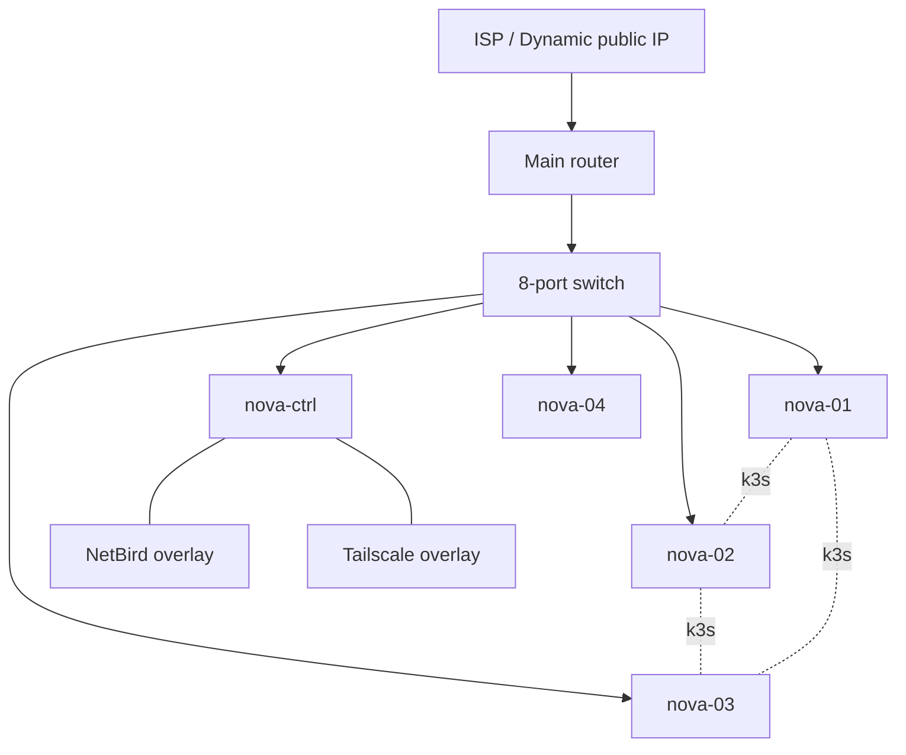
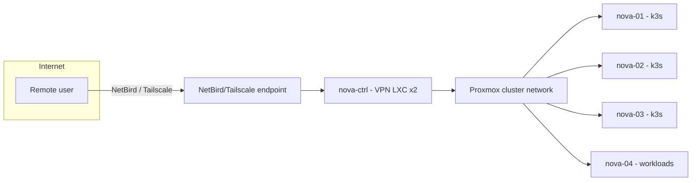

# Network — Topology

All documentation-safe addressing below uses `192.0.2.0/24` (TEST-NET) as examples.
Real subnets are `TODO(T7)`.

## Physical topology

## Logical view

## Description

- The router is the single L3 gateway; all nodes hang off the 8-port switch.
- **k3s traffic** (control plane + workload data plane) flows over the cluster network
  between nova-01, nova-02, nova-03. `TODO(T2)` defines which node is the server.
- **Remote access** rides the NetBird and Tailscale overlays, so inbound connections
  are tunnelled through the VPN LXCs on nova-ctrl (`TODO(T3)`) rather than port-forwarded
  through the consumer router. This matches a dynamic-IP home link.
- **Public exposure** is limited to services explicitly marked internet-facing
  (`TODO(T10)`); Immich and Dokploy are known candidates.

## Subnets and VLANs

Segmentation uses VLANs; IDs and purposes are `TODO(T7)`. Which VLAN carries the nova
nodes is `TODO(T8)`. Local DNS/ad-blocking, if any, is `TODO(T9)`. See
[vlans-subnets.md](vlans-subnets.md).

Related: [vlans-subnets.md](vlans-subnets.md) · [vpn.md](../services/vpn.md) ·
[README](../README.md)